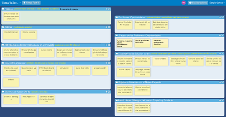
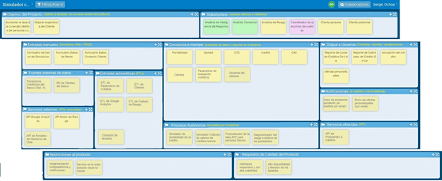

# Requisitos de Gobernabilidad e Integración de Sistemas

|Versión|Autor|Descripción|Fecha|
|---|---|---|---|
|1.0|sochoa@dcc.uchile.cl|versión inicial|Marzo 2022|
|1.1|jarriagada@dcc.uchile.cl|reestructuración, revisión y actualización|Marzo 2023|

___

## Contenidos

Para asegurar en gran medida la gobernabilidad de las aplicaciones y la integración entre ellas, cada sistema que se ponga en producción en el DCC debe incluir (al menos) lo siguiente:

- [Descripción del proceso que apoya](#descripción-del-proceso-que-apoya): incluye objetivo, actores, macro-tareas, workflow y dolores del proceso y sus posibles causas. El proceso debe describirse usando la nomenclatura BPMN.
- [Objetivo y alcance del sistema](#objetivo-y-alcance-del-sistema): debe especificarse utilizando un tablero de alcance de productos.
- [Arquitectura del ecosistema](#arquitectura-del-ecosistema): el diagrama del ecosistema debe indicar la relación entre sistema descrito y otros con los que interactúa. La especificación de la arquitectura debe hacerse utilizando modelos de contexto de C4.
- [Arquitectura del software](#arquitectura-del-software): esta arquitectura debe especificarse usando contenedores y componentes de C4.
- [Modelo de datos](#modelo-de-datos): el modelo de datos debe contar con todos los elementos mandatorios de uno. Debe estar basado en tablas donde se especifique las relaciones y cardinalidad entre ellas, así como también señalar su llave principal y foráneas (si es que las hay).
- [API para acceder a servicios o datos que ofrece el sistema](#api-para-acceder-a-servicios-o-datos-que-ofrece-el-sistema): debe implementarse una API a través de la cual otros sistemas puedan acceder a sus servicios o datos. Esta debe estar apropiadamente documentada en Swagger.
- [Autenticación de Usuarios](#autenticación-de-usuarios): debe utilizar los servicios que provee el DCC. Se debe implementar un esquema propio de roles y permisos.
- [Código fuente debe estar apropiadamente versionado](#código-fuente-debe-estar-apropiadamente-versionado): debe utilizarse una herramienta de control de versiones (Git).
- [Stack tecnológico utilizado](#stack-tecnológico-utilizado): incluir tecnologías y sus versiones mínimas requeridas para su funcionamiento.
- [Indicaciones para el deployment](#indicaciones-para-el-deployment): las indicaciones deben contener los pasos y requerimientos necesarios para que un tercero pueda levantar un ambiente de desarrollo y/o poner en producción al software.

___

## Detalle de los Requisitos de Gobernabilidad e Integración

A continuación se detallan los principales requisitos con los que debe cumplir cualquier sistema implantado en el DCC, con el objetivo de cumplir con un nivel mínimo de gobernabilidad.

[<- Volver](#contenidos)

___

## Descripción del proceso que apoya

Esto incluye el objetivo del proceso abordado, sus actores, las macro-tareas, el workflow del mismo, los dolores actuales del proceso (problemas a resolver u oportunidades a aprovechar) y sus eventuales causas. 

El proceso debe describirse usando la nomenclatura [BPMN](https://www.bpmn.org/), si es éste es estructurado. Además, la descripción general del proceso debe especificarse a través de un tablero digital del tipo: “exploración del problema y contexto”, como el que se muestra a continuación.

Puedes utilizar la herramienta web [Tablero Digital](https://dcc-cc5401.herokuapp.com/).

[<- Volver](#contenidos)

___

## Objetivo y alcance del sistema

Esto debe especificarse utilizando un tablero digital de alcance de productos (tablero de scoping), como el que se muestra a continuación.

Puedes utilizar la herramienta web [Tablero Digital](https://dcc-cc5401.herokuapp.com/), o utilizar las plantillas PDF para [Tableros de Scoping de Sistemas de Información](archivos/TableroScopingSistemasInformacion.pdf), o [Tableros de Scoping de Sistemas de Procesamiento Masivo de Datos](archivos/TableroScopingSistemasDatos.pdf).

[<- Volver](#contenidos)

___

## Arquitectura del ecosistema

Se debe indicar la relación entre el sistema descrito, y otros sistemas (incluyendo bases de datos, colas de mensajería, etc.) con los que éste interactúa. La especificación de la  arquitectura del ecosistema debe hacerse utilizando modelos de contexto en [C4model](https://c4model.com/). 

Esta especificación ayuda a entender la integración e interacción entre los distintos sistemas del DCC.

[<- Volver](#contenidos)

___

## Arquitectura del software

Esta arquitectura debe estar especificada utilizando modelos de Contenedores y Componentes de [C4model](https://c4model.com/).

[<- Volver](#contenidos)

___

## Modelo de datos

En casi todos los casos, el modelo de datos de los sistemas es relacional, por lo tanto, se espera que el modelo cuente con los elementos típicos y mandatorios de este tipo de especificación; es decir, un modelo basado en tablas, con relaciones y cardinalidades entre ellas. Además, para cada tabla debe indicarse la clave primaria, las claves foráneas (si las hay) y los atributos de dicha entidad de datos.

En algunos casos, por ejemplo cuando existe un ORM que funciona como una capa de abstracción con la base de datos, el modelo de datos puede ser reemplazado por un modelo de Clases que muestre las clases principales del sistema y su relación con las clases propias del framework/librerías utilizado.

[<- Volver](#contenidos)

___

## API para acceder a servicios o datos que ofrece el sistema

Si los datos del sistema son la fuente de verdad en algún ámbito específico de negocio, entonces éste debe implementar una API a través de la cual otros sistemas puedan acceder a sus datos o servicios. Dicha API debe estar documentada en Swagger o similar.

[<- Volver](#contenidos)

___

## Autenticación de Usuarios

Debe utilizar los servicios que provee el DCC. Se debe implementar un esquema propio de roles y permisos.

[<- Volver](#contenidos)

___

## Código fuente debe estar apropiadamente versionado

Debe utilizarse una herramienta de control de versiones (Git); todo el código y documentación de los sistemas del DCC debe quedar almacenado el el GitHub oficial definido por el Área de Desarrollo de Software.

[<- Volver](#contenidos)

___

## Stack tecnológico utilizado

Incluir tecnologías y sus versiones mínimas requeridas para su funcionamiento.

[<- Volver](#contenidos)

___

## Indicaciones para el deployment

Las indicaciones deben contener los pasos y requerimientos necesarios para que un tercero pueda levantar un ambiente de desarrollo y/o poner en producción al software.

[<- Volver](#contenidos)